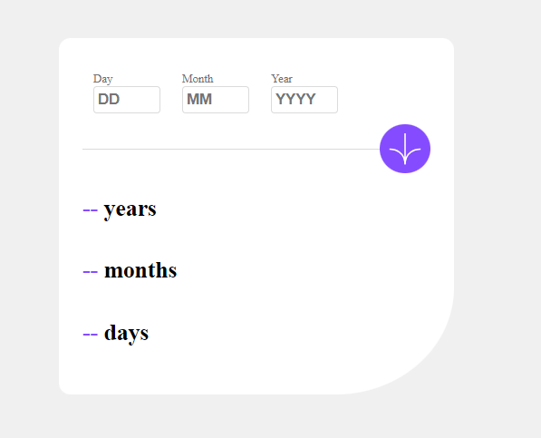
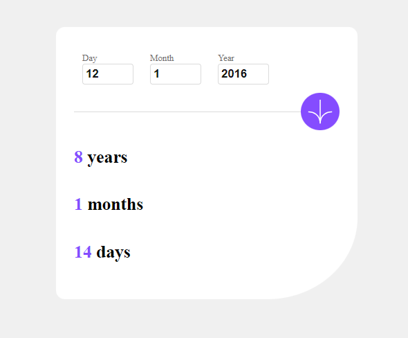

# Age Calculator App

## Table of Contents

- [overview](#overview)
- [Project Structure](#project-structure)
- [Screenshots](#screenshots)
- [Usage](#usage)
- [Input Validation](#input-validation)
- [Age Calculation](#age-calculation)
- [Getting Started](#getting-started)

## Overview
This project is a simple Age Calculator web application that allows users to input their birthdate (day, month, and year) and calculates their age in years, months, and days. The application is designed with a clean and user-friendly interface.

## Screenshots

## Project Structure
- **index.html**: The main HTML file containing the structure of the web page, including input fields for day, month, and year, a submit button, and a section to display the calculated age.
- **index.css**: The CSS file providing styles for the HTML elements, ensuring a visually appealing and responsive layout.
- **index.js**: The JavaScript file handling the logic of the Age Calculator, including input validation and age calculation.

## Usage
1. Open the `index.html` file in a web browser.
2. Input the birthdate details (day, month, and year) into the respective fields.
3. Click the submit button to calculate the age.
4. The calculated age will be displayed in years, months, and days.

## Input Validation
- The application validates input for the day, month, and year fields, ensuring they are not empty and within valid ranges.
- Error messages are displayed if input is invalid.

## Age Calculation
- The age is calculated based on the provided birthdate using the current date.
- The result is displayed in the designated section of the web page.

## Getting Started
To run this project locally, follow these steps:
1. Clone the repository: `git clone [repository_url]`
2. Open `index.html` in a web browser.

