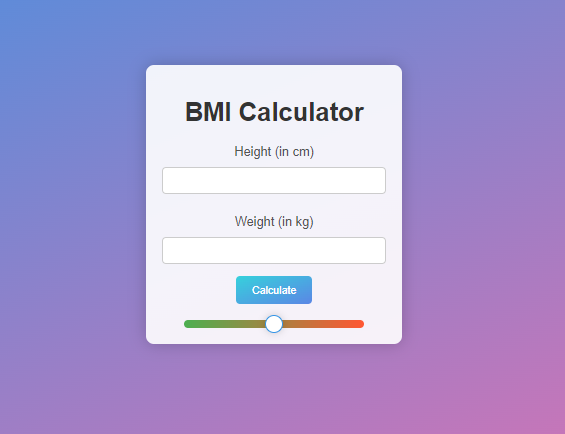
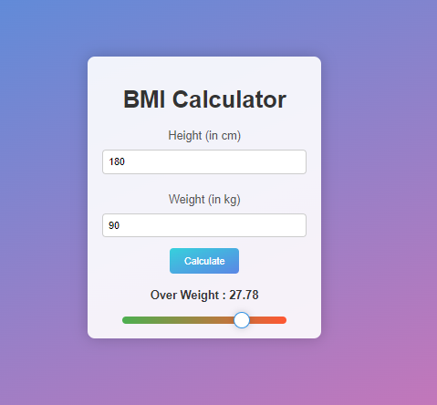
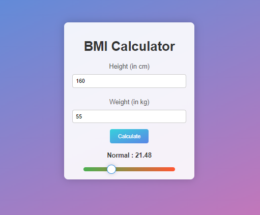

# BMI Calculator Web App

## Table of Contents

- [Description](#description)
- [Screenshots](#screenshots)
- [Features](#features)
- [Technologies Used](#technologies-used)
- [How to Use](#how-to-use)

## Description 
A simple Body Mass Index (BMI) calculator implemented as a web application. This application allows users to input their height (in centimeters) and weight (in kilograms) to calculate their BMI. The BMI is then categorized as Underweight, Normal, or Overweight, and a visual representation is displayed on a gradient line.

## Screenshots

## Features

- **User Input**: Users can input their height and weight using the provided input fields.
- **BMI Calculation**: Calculates BMI based on the provided height and weight.
- **BMI Categories**: Displays the BMI category as Underweight, Normal, or Overweight.
- **Visual Representation**: A circle moves along a gradient line to visually represent the user's BMI.

## Technologies Used

- **HTML**: Structuring the web page.
- **CSS**: Styling the web page for a clean and user-friendly interface.
- **JavaScript**: Handling user interactions, BMI calculations, and updating the visual representation.

## How to Use

1. Open `index.html` in a web browser.
2. Enter your height in centimeters in the "Height" input field.
3. Enter your weight in kilograms in the "Weight" input field.
4. Click the "Calculate" button.
5. The BMI category and a visual representation will be displayed.

