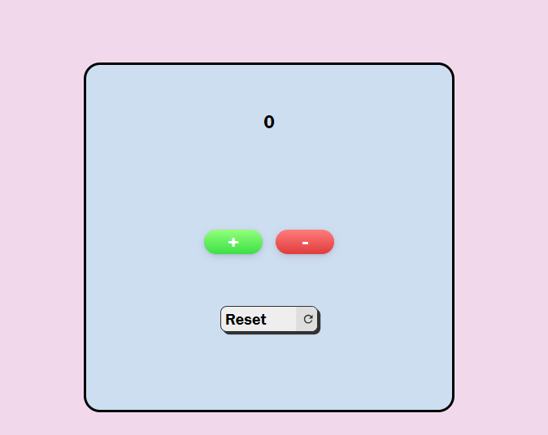

# Counter App


## About 
A simple counter app built with HTML, CSS, and JavaScript. Allows users to increase, decrease, and reset the counter.


## Screenshots



## Features

- User-friendly interface with a clean design.
- Buttons to increase, decrease, and reset the counter.
- Responsive layout for various screen sizes.

## Getting Started

Follow these steps to get a copy of the project on your local machine:

1. Clone the repository:
   ```bash
   git clone https://github.com/Astbrqeg/repo-name.git

2. Navigate to the project directory:
   ```bash
   cd repo-name

3. Open the current project directory in Visual Studio Code:
   ```bash
   code .

4. Open the index.html file in your preferred browser

## Usage
1. Click the "+" button to increase the counter.
2. Click the "-" button to decrease the counter.
3. Click the "Reset" button to set the counter back to 0.