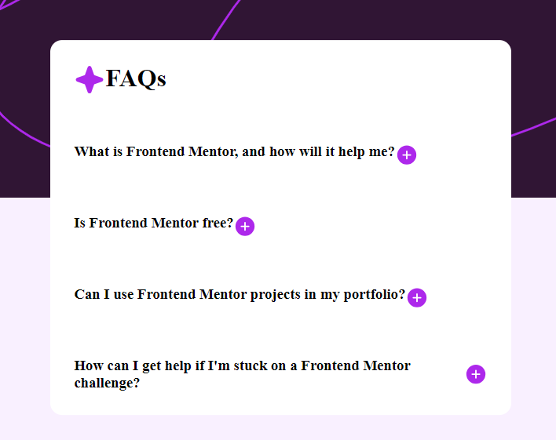
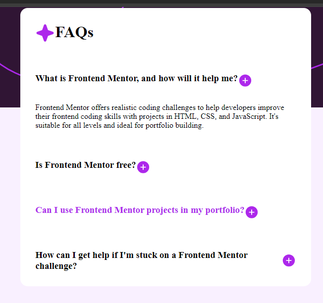

# FAQ Accordion

## Table of Contents

- [About](#about)
- [Description](#description)
- [Demo](#demo)
- [Screenshots](#screenshots)
- [Features](#features)
- [Getting Started](#getting-started)
- [Usage](#usage)


## About
A simple FAQ accordion with a clean and responsive design, allowing users to easily navigate through frequently asked questions.

## Description

This project features an FAQ section with an accordion-style interface. Users can click on questions to reveal or hide the answers, providing a smooth and intuitive experience. The design is clean, and the functionality is implemented using HTML, CSS, and JavaScript.
## Demo
 https://faqsa.netlify.app/


## Screenshots




## Features

- Responsive design for various screen sizes.
- Smooth accordion-style interaction.
- Clean and modern UI.

## Getting Started

Follow these steps to get a copy of the project on your local machine:

1. Clone the repository:
   ```bash
   git clone https://github.com/Astbrqeg/repo-name.git

2. Navigate to the project directory:
   ```bash
   cd repo-name

3. Open the current project directory in Visual Studio Code:
   ```bash
   code .

4. Open the index.html file in your preferred browser

## Usage
# Exploring FAQs:

- Scroll through the list of questions.
- Click on a question to reveal its answer.
- Click again to hide the answer.
# Navigating Sections:

- Questions are categorized into sections.
- Click on a section to quickly navigate to related questions.
# Interaction on Hover:

- Hover over questions to see a subtle color change.
- Easily identify which questions are interactive.