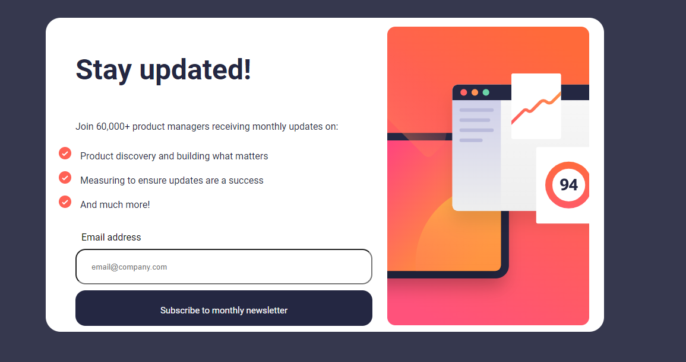
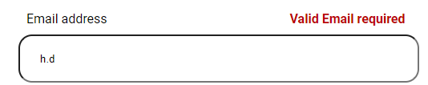
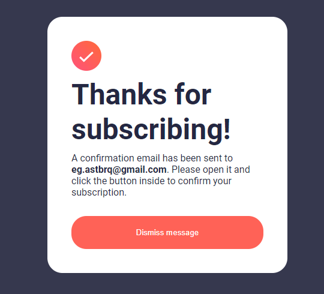

# Newsletter Sign-up Form with Success Message

## Table of Contents

- [About](#about)
- [Description](#description)
- [Demo](#demo)
- [Screenshots](#screenshots)
- [Getting Started](#getting-started)
- [Usage](#usage)


## About
A responsive newsletter sign-up form with a success message, designed to keep users informed about monthly updates.


## Description

This project is a responsive newsletter sign-up form built with HTML, CSS, and JavaScript. It validates email input and displays a success message upon successful subscription.

## Demo

 (https://newslettersignupm.netlify.app/)

## Screenshots





## Getting Started

Follow these steps to get a copy of the project on your local machine:

1. Clone the repository:
   ```bash
   git clone https://github.com/Astbrqeg/repo-name.git

2. Navigate to the project directory:
   ```bash
   cd repo-name

3. Open the current project directory in Visual Studio Code:
   ```bash
   code .

4. Open the index.html file in your preferred browser.


## Usage

# Entering Email Address:

-  Locate the input field labeled "Email address."
- Enter a valid email address in the input field.
# Subscribing to Newsletter:

- Click the "Subscribe to monthly newsletter" button.
- Ensure the entered email is valid; otherwise, a warning message will appear.
# Success Message:

- Upon successful subscription, a confirmation message will be displayed.
- The confirmation message includes details about the confirmation email.
# Dismissing Message:

- To return to the form, click the "Dismiss message" button.