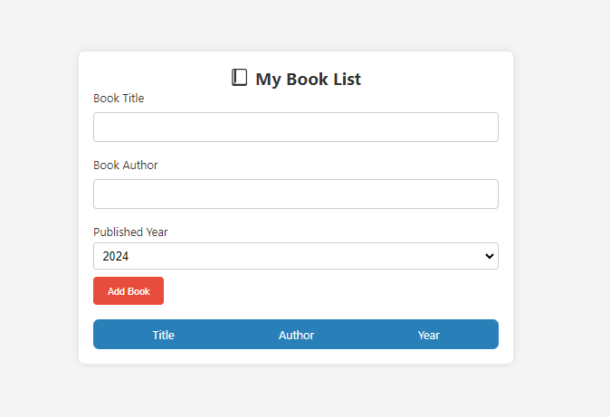
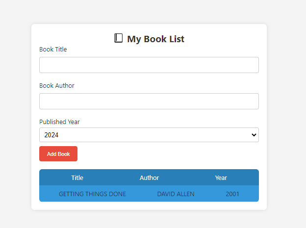
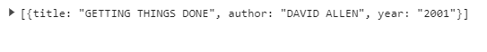

# Book List Project

This project is a simple web application for managing a book list. Users can add books with details such as title, author, and published year. The application provides an easy and intuitive interface for users to keep track of their reading list.

## Table of Contents
- [Project Overview](#project-overview)
- [Screenshots](#screen-shots)
- [Key Features](#key-features)

## Project Overview

The main goal of this project is to offer users a convenient way to manage their book collections. With a user-friendly form, users can input book details, and the added books are displayed in a clear table format for quick reference.

## ScreenShots

### Key Features

- **Add Books:** Users can easily add books to their list by providing the title, author, and published year through a simple form.
- **Display:** The application displays the added books in a table, showing essential information like title, author, and year.
- **Local Storage:** Book data is stored locally, allowing users to access their book list even after closing and reopening the browser.

