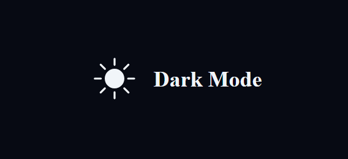

# Dark Mode Switcher

This project is a simple web application that allows users to toggle between light and dark modes using a button. The application is built with HTML, CSS, and JavaScript.

## Table of Contents

- [Introduction](#dark-mode-switcher)
- [Usage](#usage)
- [Screenshots](#screen-shots)

## ScreenShots

## Usage

The project provides a button that enables users to switch between light and dark modes. Clicking the button will toggle the appearance of the page between light and dark themes.

## Project Structure

- `index.html`: Main HTML file.
- `index.css`: Stylesheet for the project.
- `index.js`: JavaScript file for handling the theme toggling functionality.

