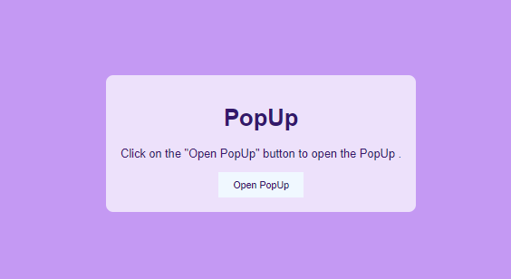
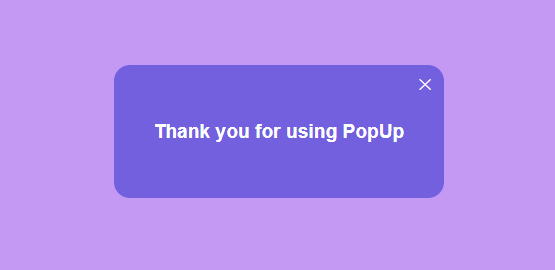

# PopUp Message

This project is a simple web application that demonstrates a pop-up message. Users can click the "Open PopUp" button to toggle the visibility of a pop-up message.

## Table of Contents

- [Introduction](#popup-message)
- [Usage](#usage)
- [Features](#features)
- [Project Structure](#project-structure)
- [Screenshots](#screenshots)

## ScreenShots

## Usage

The project consists of a button, "Open PopUp," which, when clicked, opens a pop-up message. Users can close the pop-up message by clicking the close (X) button within the pop-up.

## Features

- Simple pop-up message functionality.
- Easy-to-use interface.

## Project Structure

- `index.html`: Main HTML file.
- `index.css`: Stylesheet for the project.
- `index.js`: JavaScript file for handling the pop-up functionality.

