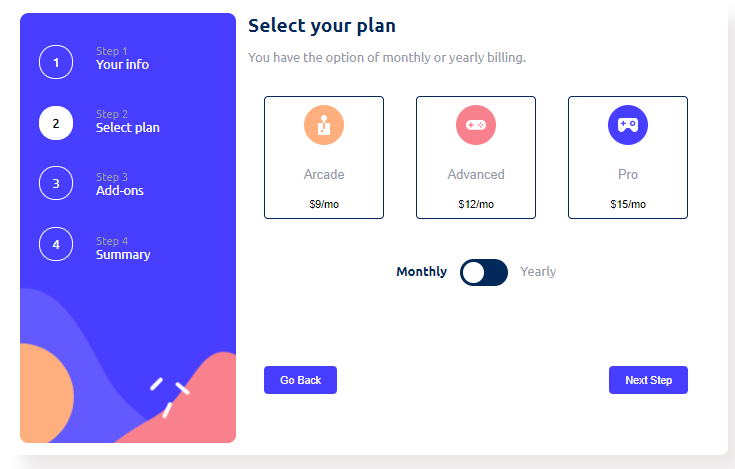

## Multi-step Form

- [About](#about)
- [Demo](#demo)
- [Screenshots](#screenshots)
- [Structure](#structure)
- [Usage](#usage)
- [Dependencies](#dependencies)
- [Setup](#setup)
- [Additional Information](#additional-information)

## About
 A multi-step form for subscription management, designed for an online gaming platform. Users can provide personal information, select subscription plans, choose add-ons, review their choices, and confirm their subscription.

 ## Demo
https://multi-stp-frm.netlify.app/

 ## Screenshots
 
 
 
 
 
 
## Structure

The project consists of HTML, CSS, and JavaScript files.

- `index.html`: Contains the structure of the multi-step form.
- `index.css`: Styles the HTML elements for better visualization.
- `index.js`: Provides interactivity to the form, such as navigating between steps and calculating prices.

## Usage

To run the project, simply open the `index.html` file in a web browser.

## Dependencies

The project utilizes the following dependencies:

- Google Fonts: Provides the 'Ubuntu' font for better typography.
## Setup

No setup is required for this project. Simply open the `index.html` file in a web browser to use the multi-step form.

## Additional Information

- The form allows users to switch between monthly and yearly subscription options.
- Users can select from a variety of subscription plans and add-ons.
- Validation is implemented to ensure users provide necessary information before proceeding to the next step.
