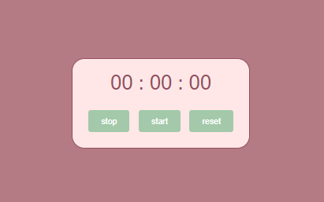
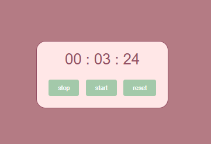

# Stop Watch

This project is a simple web application for a stopwatch. Users can start, stop, and reset the timer using the provided buttons.

## Table of Contents

- [Introduction](#stop-watch)
- [Screenshots](#screenshots)
- [Usage](#usage)
- [Project Structure](#project-structure)

## Screenshots

## Usage

The stopwatch displays hours, minutes, seconds, and milliseconds. Users can interact with the following buttons:

- **Start:** Initiates the timer.
- **Stop:** Pauses the timer.
- **Reset:** Resets the timer to 00:00:00.

## Project Structure

- `index.html`: Main HTML file.
- `index.js`: JavaScript file for stopwatch functionality.
- `index.css`: Stylesheet for the project.

